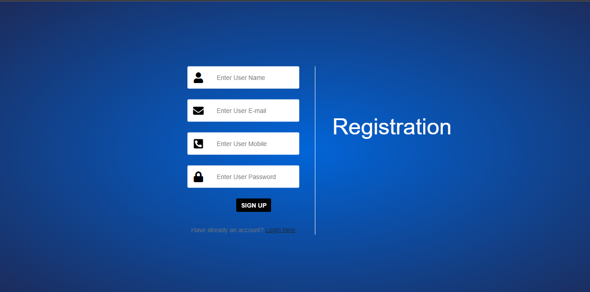
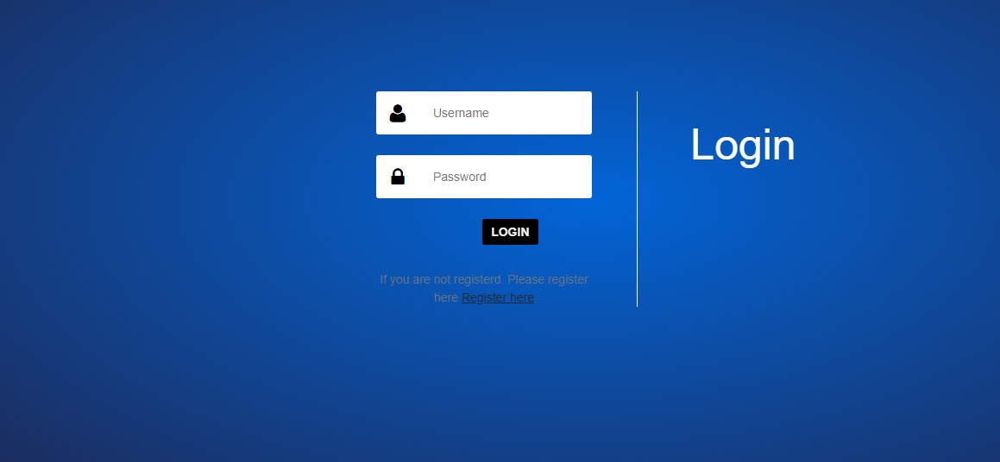
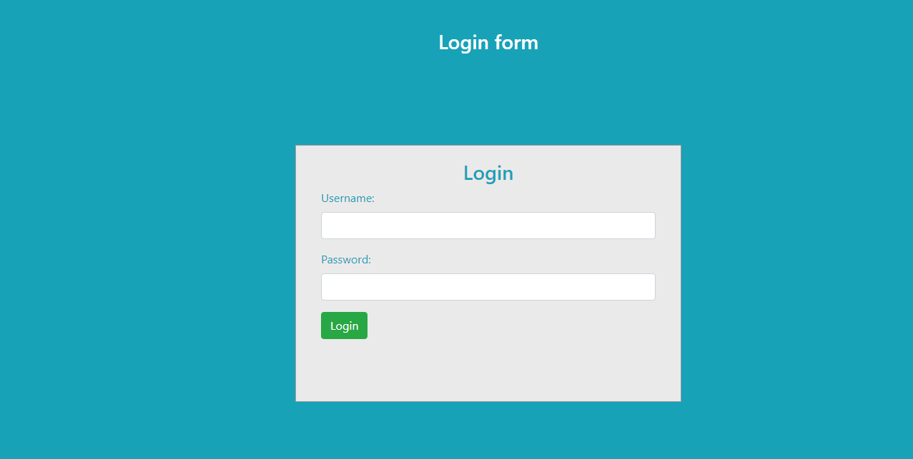
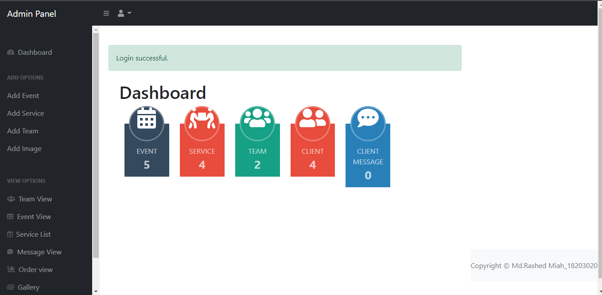
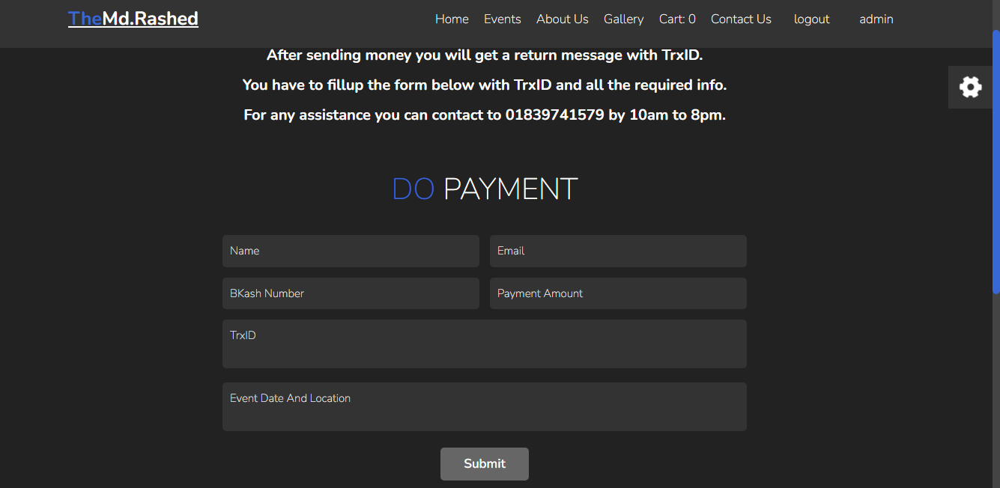
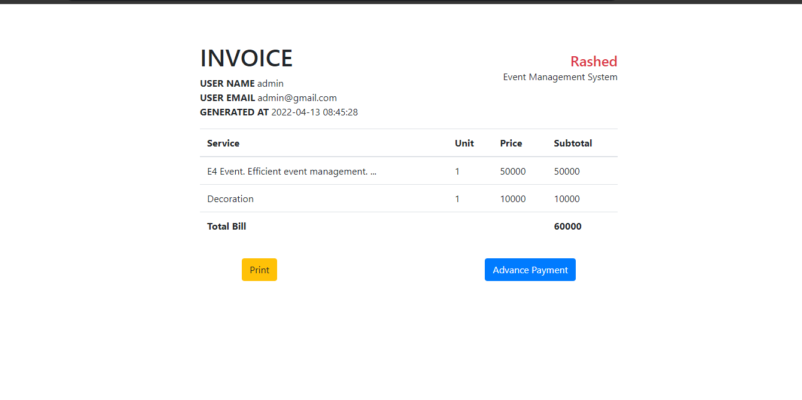

```markdown
# 🎉 Event Management System - Brothers Dream It Ltd


A modern web-based solution to streamline event planning, booking, and management for **Brothers Dream It Ltd**. Designed to automate manual workflows and enhance operational efficiency. 🚀

---

## 📜 Table of Contents
- [Project Overview](#-project-overview)
- [Key Features](#-key-features)
- [Tech Stack](#-tech-stack)
- [Installation](#-installation)
- [Screenshots](#-screenshots)
- [Limitations & Future Scope](#-limitations--future-scope)
- [Acknowledgments](#-acknowledgments)
- [License](#-license)

---

## 🌟 Project Overview

**Event Management System (EMS)** is a centralized platform developed for **Brothers Dream It Ltd** to manage events, service providers, bookings, payments, and reporting. It replaces paper-based processes with a secure digital system, enabling:

- **Admins** to manage events, venues, sponsors, and generate reports.
- **Customers** to browse events, book services, and track payments.
- **Automated record-keeping** with a MySQL database.

---

## ✨ Key Features

### **Admin Panel**
- 📅 Create, update, and delete events, categories, and venues.
- 👥 Manage organizers, sponsors, and supervisors.
- 💸 Track payments and generate financial reports.
- 📊 Monitor event schedules and customer bookings.
- 🔐 Secure authentication and role-based access.

### **Customer Portal**
- 🔍 Browse upcoming events with filters (category, venue, date).
- 🛒 Book events and view cart/invoice.
- 📝 Edit profile and track booking status.
- 📲 Responsive design for seamless mobile experience.

---

## 🛠 Tech Stack

- **Frontend**: HTML5, CSS3, Bootstrap 5, JavaScript
- **Backend**: PHP 8.x, Laravel 8.x
- **Database**: MySQL
- **Tools**: XAMPP, VS Code, Draw.io (for ER diagrams)
- **Hosting**: Local Server (Bitnami)

---

## 📥 Installation

1. **Prerequisites**:
   - PHP 8.x, Composer, XAMPP, Node.js, npm.
   - Clone the repository:
     ```bash
     git clone https://github.com/rashed9810/Event-management-system.git
     ```

2. **Setup**:
   - Import the SQL database from `database/ems.sql`.
   - Configure your `.env` file with your database credentials.
   - Install dependencies:
     ```bash
     composer install
     npm install
     ```

3. **Run**:
   ```bash
   php artisan serve
   ```
   Access the application at `http://localhost:8000`.

---

## 📸 Screenshots

| Feature                | Preview                                                              |
|------------------------|----------------------------------------------------------------------|
| **Home**               |                                            |
| **User Registration**  |                   |
| **User Login**         |                                 |
| **Admin Login**        |                           |
| **Admin Dashboard**    |                        |
| **Event Booking**      |                                 |
| **Payment Invoice**    |                                  |

---

## ⚠️ Limitations & Future Scope

- **Current Limitations**:
  - Manual payment processing (no gateway integration).
  - No email/SMS notifications.
  - Limited event categories.

- **Future Improvements**:
  - Integrate PayPal/Stripe for online payments.
  - Add real-time notifications and calendar sync.
  - Expand event types and implement multi-language support.

---

## 🙏 Acknowledgments

- **Supervisor**: Mr. Rashedul Islam (Assistant Professor, IUBAT).
- **Department**: Computer Science & Engineering, IUBAT.
- **Mentors**: Brothers Dream It Ltd development team.

---

## 📄 License

This project is licensed under the **MIT License**. See below for the full text:

```text
MIT License

Copyright (c) 2022 Md. Rashed Miah

Permission is hereby granted, free of charge, to any person obtaining a copy
of this software and associated documentation files (the "Software"), to deal
in the Software without restriction, including without limitation the rights
to use, copy, modify, merge, publish, distribute, sublicense, and/or sell
copies of the Software, and to permit persons to whom the Software is
furnished to do so, subject to the following conditions:

The above copyright notice and this permission notice shall be included in all
copies or substantial portions of the Software.

THE SOFTWARE IS PROVIDED "AS IS", WITHOUT WARRANTY OF ANY KIND, EXPRESS OR
IMPLIED, INCLUDING BUT NOT LIMITED TO THE WARRANTIES OF MERCHANTABILITY,
FITNESS FOR A PARTICULAR PURPOSE AND NONINFRINGEMENT. IN NO EVENT SHALL THE
AUTHORS OR COPYRIGHT HOLDERS BE LIABLE FOR ANY CLAIM, DAMAGES OR OTHER
LIABILITY, WHETHER IN AN ACTION OF CONTRACT, TORT OR OTHERWISE, ARISING FROM,
OUT OF OR IN CONNECTION WITH THE SOFTWARE OR THE USE OR OTHER DEALINGS IN THE
SOFTWARE.
```

Alternatively, refer to the [LICENSE](LICENSE) file for details.

---

**Crafted with ❤️ by Md. Rashed Miah**  
*ID: 18203020 | Bachelor of Computer Science & Engineering, IUBAT*

---

### 🎯 Why This Stands Out?
- **User-Centric Design**: Clean UI with Bootstrap for seamless navigation.
- **Scalable Architecture**: Built on Laravel for easy future enhancements.
- **Comprehensive Documentation**: Detailed report with ER diagrams, DFDs, and process models.

⭐ **Star the repo if you find this useful!** ⭐
```